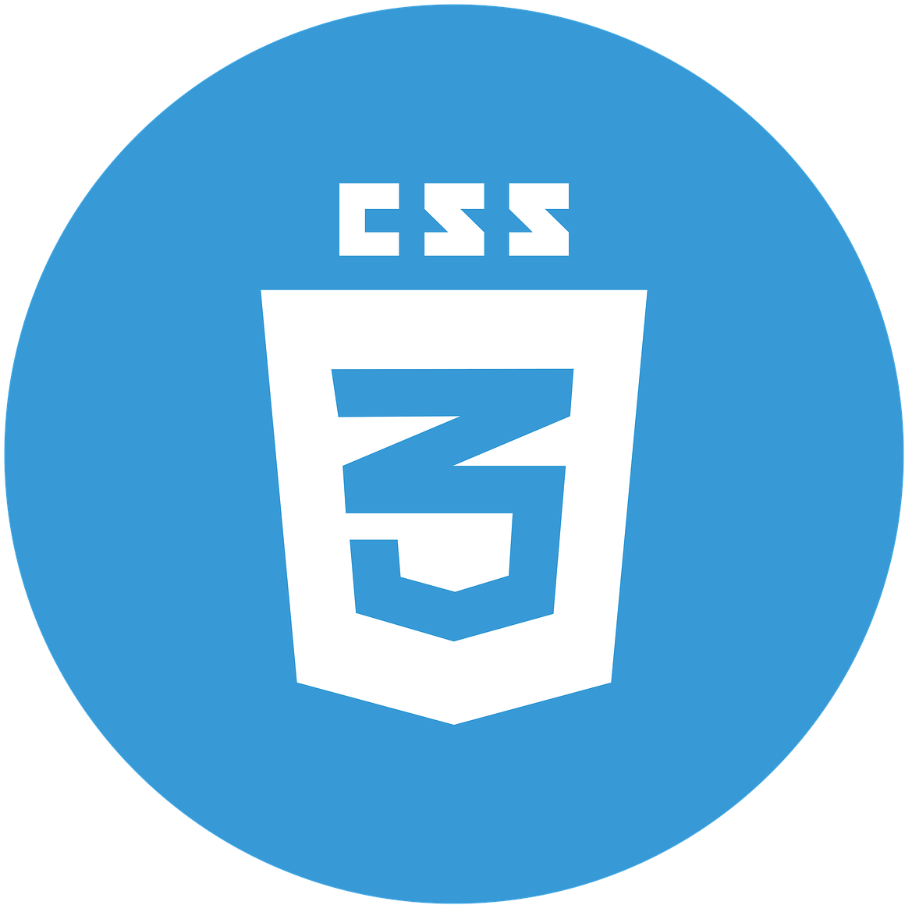
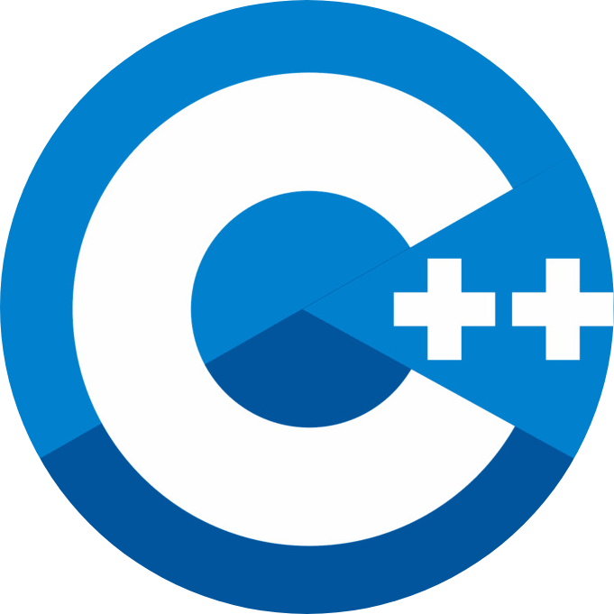

  

  # ```<Hello World/>```  

  #### I am Rahul Gorai, a sophomore @ IIT Kharagpur
  - Pronouns: He/Him
  - JS dev by day | Pythonista by night
  - Open source == ❤️
  - Web dev ⬄ ML
  - Eat. Code. Sleep. Repeat.

  #### 👨🏻‍💻 Languages and Tools <br />

  <p>
    
    
    
    
    
    
    
    
    
    
    
    
  </p>

   #### 📫 Let's connect
  <a href="mailto:rahul.gorai.3141@gmail.com"></a>
  <a href="https://www.facebook.com/rahul.gorai.526/"></a>
  <a href="https://www.instagram.com/irrational_constant/"></a>
  <a href="https://www.linkedin.com/in/rahul-gorai-86a7041a2/"></a>

  #### 📖 Quote of the day
[]

  ### Thanks for visiting. May the force be with you!